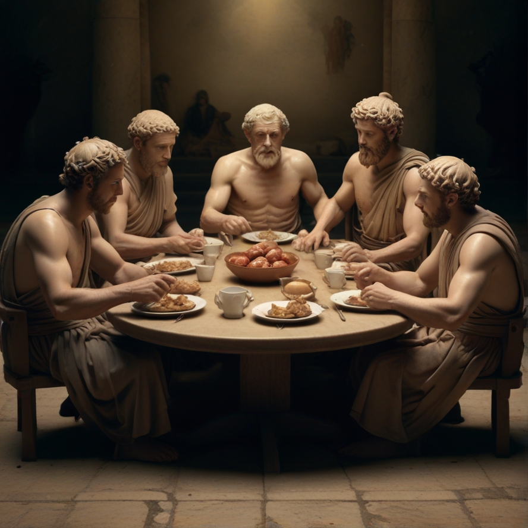

# Dining Philosophers Problem Simulation

## Overview

This project presents a simulation of the classic concurrency problem known as the "Dining Philosophers". It embodies the challenge of resource allocation and synchronization among processes to prevent deadlocks.

The problem is illustrated by five philosophers who sit around a table and engage in two activities: eating and thinking. They share forks, and each philosopher needs two forks to eat a bowl of spaghetti at the center of the table. 

The simulation uses threads to represent the philosophers and mutexes for the forks to ensure mutual exclusion.



## Features

- Multi-threaded simulation of five philosophers.
- Use of mutexes to manage resource allocation (forks).
- Customizable parameters for the time spent eating, thinking, and sleeping.
- Logging to monitor the state of each philosopher and resource contention.

## Getting Started

### Prerequisites

- A C compiler like `gcc`.
- POSIX Threads library for threading support.

### Installation

1. Clone the repo:
```bash
git clone https://github.com/48k483x/Philosophers.git
```
### Usage

1. Compile the program
```bash
make fclean && make && make clean
```
2. Run the program in your terminal
```bash
./philo number_of_philosophers time_to_die time_to_eat time_to_sleep
        [number_of_times_each_philosopher_must_eat] 
```
### Simulation Rules

1. Philosophers alternate between eating and thinking.
2. A philosopher can only eat if they have both left and right forks.
3. A philosopher puts down both forks after eating and starts thinking.
4. The simulation ends if a philosopher can't eat and starves (simulation parameter).

